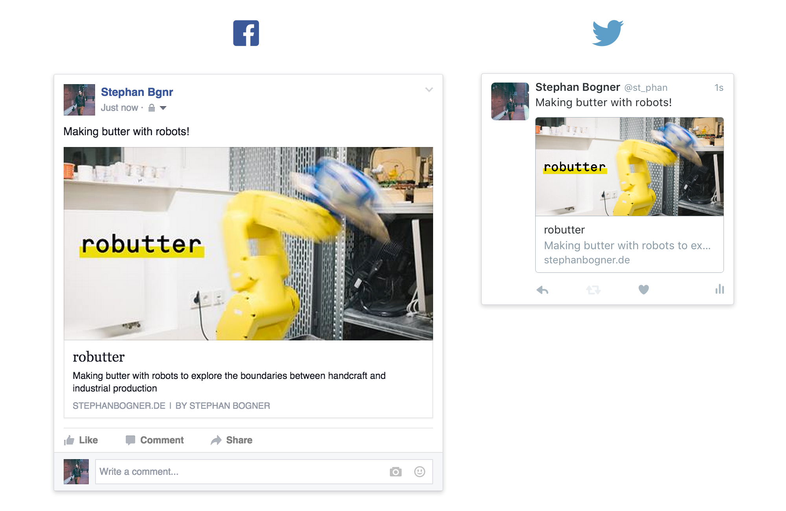

# Link Preview for Social Networks from Kirbytext



## About
This code is written for the [Kirby CMS](getkirby.com) to generate social media meta tags. This results in having a nice preview when posting a link on Facebook, Twitter, LinkedIn and more! (See example above)

I wrote this script for publishing a project called [robutter](http://stephanbogner.de/projects/robutter).

<!-- START doctoc generated TOC please keep comment here to allow auto update -->
<!-- DON'T EDIT THIS SECTION, INSTEAD RE-RUN doctoc TO UPDATE -->
- [About](#about)
- [Installation](#installation)
  - [1. Download the script](#1-download-the-script)
  - [2. Move to Kirby Snippet folder](#2-move-to-kirby-snippet-folder)
  - [3. Edit default twitter handle](#3-edit-default-twitter-handle)
  - [4. Add to Website Header](#4-add-to-website-header)
  - [5. Add Open Graph HTML prefix](#5-add-open-graph-html-prefix)
  - [6. Done, go write some posts!](#6-done-go-write-some-posts)
- [Writing a Kirby Post](#writing-a-kirby-post)
  - [Explicit use](#explicit-use)
    - [Tags for Twitter:](#tags-for-twitter)
    - [Tags for OpenGraph:](#tags-for-opengraph)
  - [Defaults](#defaults-if-you-dont-specify-the-tags-explicitly)
    - [General](#general)
    - [Twitter specific](#twitter-specific)
    - [OpenGraph specific](#opengraph-specific)
  - [Example Markdown](#example-markdown)
- [Testing](#testing)
- [License](#license)

<!-- END doctoc generated TOC please keep comment here to allow auto update -->

## Installation
### 1. Download the script 
[Download](https://raw.githubusercontent.com/stephanbogner/Link-Preview-for-Social-Networks-from-Kirbytext/master/social-media-meta-tags.php) the **social-media-meta-tags.php** from this repo.

### 2. Move to Kirby Snippet folder 
**Move the file** you just downloaded to the **Kirby Snippets folder** located in `Kirby ▶ site ▶ snippets`.

### 3. Edit default twitter handle
**Open the file** in a text editor and replace **st_phan** in the 4th line with your Twitter handle.

### 4. Add to Website Header
Make changes to your Kirby header file located at `Kirby ▶ site ▶ snippets ▶ header.php` by adding following snippet:

`<?php snippet('social-media-meta-tags') ?>`

**Example result:**
```HTML
<!DOCTYPE html>
<html lang="en" prefix="og: http://ogp.me/ns#">
<head>

  <meta charset="utf-8" />
  <meta name="viewport" content="width=device-width,initial-scale=1.0">

  <title><?php echo $site->title()->html() ?> | <?php echo $page->title()->html() ?></title>
  <meta name="description" content="<?php echo $site->description()->html() ?>">
  <meta name="keywords" content="<?php echo $site->keywords()->html() ?>">

  <?php snippet('social-media-meta-tags') ?>
  <?php echo css('assets/css/main.css') ?>

</head>
<body>
  <header class="header cf" role="banner">
    <a class="logo" href="<?php echo url() ?>">
      " alt="<?php echo $site->title()->html() ?>" />
    </a>
    <?php snippet('menu') ?>
  </header>
```

### 5. Add Open Graph HTML prefix

For Open Graph you have to add a prefix to your html-tag

e.g. `<html prefix="og: http://ogp.me/ns#>` (in the example above, this can also be seen)

### 6. Done, go write some posts!

## Writing a Kirby Post

### Explicit use
Now you have to define what should be displayed when your link gets posted. This is done by adding custom tags to your Kirbytext markdown - see defaults for what happens when you don't define them.

#### Tags for Twitter:
**Main:**

- **TwitterCard:** Card type
- **TwitterSite:** Twitter handle of 
- **TwitterCreator:** Twitter handle of page author
- **TwitterTitle:** Page title
- **TwitterDescription:** Description text
- **TwitterImage:** Image to be shown (for summary cards with images)

**Other:**

- twitterImageAlt

More infos can be found [on the Twitter Card Developer page](https://dev.twitter.com/cards/overview).

#### Tags for OpenGraph:
**Main:**

- **OpenGraphTitle:** Page title
- **OpenGraphDescription:** Description text
- **OpenGraphType:** Type of OpenGraph element
- **OpenGraphImage:** Image to be shown
- **OpenGraphUrl:** Url to page

**Other:**

- OpenGraphAudio
- OpenGraphDeterminer
- OpenGraphLocale
- OpenGraphLocaleAlternate
- OpenGraphSiteName
- OpenGraphVideo


More infos can be found on the [Open Graph Protocol page](http://opengraphprotocol.org/) or the [Facebook "Open Graph Stories"-page](https://developers.facebook.com/docs/sharing/opengraph).


### Defaults (if you don't specify the tags explicitly)
#### General
- **Title**
	1. The OpenGraph title, or (Twitter only)
	2. The title of the page
- **Image**
	1. The OpenGraph image, or (Twitter only)
	2. An image called 'opengraph.jpg', or
	3. An image called 'opengraph.png', or
	4. The first image of the project (which might not meet the OpenGraph criteria)
- **Description**
	1. Takes the OpenGraph description, or (Twitter only)
	2. Takes the description of the website, or
	3. Will be empty

#### Twitter specific 
- **Site** ( = Twitter user)
	- A default one (specified in the file)
- **Card**
	- The default type *summary*;

#### OpenGraph specific
- **Url**
	- The url of the page
- **Type**
	- Type: Article

### Example Markdown

```
Title: robutter
----
OpenGraphTitle: robutter
----
OpenGraphDescription: Making butter with robots to explore the boundaries between handcraft and industrial production
----
OpenGraphImage: http://stephanbogner.de/content/projects/robutter/og-image.jpg
----
OpenGraphUrl: http://stephanbogner.de/projects/robutter
----
TwitterCard: summary_large_image
----
TwitterSite: @st_phan
----
TwitterImage: http://stephanbogner.de/content/projects/robutter/og-image.jpg
----
Text: You can make your own butter by shaking cream until your arms hurt. Or you can use robots instead. The resulting product is 20 jars of limited edition, hand- and robot-crafted butter. We call it *robutter*.
```

## Testing
- For Twitter: **[Twitter Card Validator](https://cards-dev.twitter.com/validator)**
- For Facebook: **[Facebook URL Debugger](https://developers.facebook.com/tools/debug/)**

## License
Public Domain

